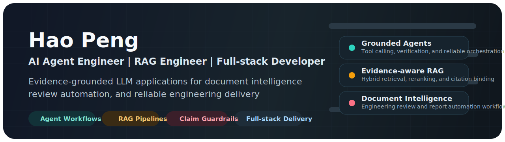
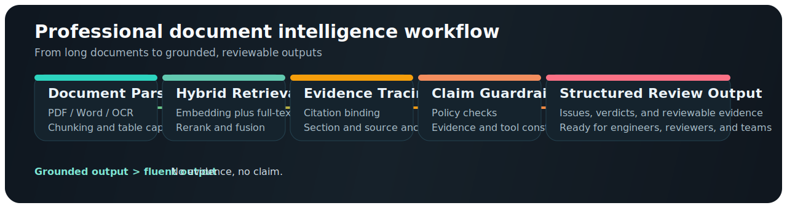

  

# Hao Peng

**AI Agent Engineer | RAG Engineer | Full-stack Developer**

> Building evidence-grounded LLM applications for professional document intelligence, review automation, and reliable AI workflows.

**Contact**  
Email: [2856006827@qq.com](mailto:2856006827@qq.com)  
GitHub: [@konoeph](https://github.com/konoeph)  
Open to: AI Agent systems | RAG engineering | document intelligence | review automation

## About Me

I come from a New Energy Science and Engineering background and now focus on practical AI engineering for complex professional content.

My work sits at the intersection of:

- Agent workflow design and ReAct-style task decomposition
- RAG pipelines with hybrid retrieval, reranking, and evidence tracing
- Claim-level verification and evidence-constrained generation
- Document parsing, OCR coordination, table extraction, and cross-section consistency checks
- Full-stack delivery with testable backend services and maintainable product structure

I care about making LLM systems not only fluent, but also traceable, auditable, and useful in real workflows.

## Workflow Lens

  

This is the shape of work I enjoy most: turning long, messy, professional documents into structured review pipelines with retrieval, evidence binding, and grounded outputs.

## What I Build

### Evidence-grounded Agent Systems

I design Agent workflows that combine tool calling, retrieval, intermediate verification, and structured outputs to make model behavior more dependable in production settings.

### RAG for Professional Review

I build retrieval and review pipelines for engineering and business documents where answers need evidence, not just fluency. That includes chunking, embedding search, hybrid retrieval, reranking, attribution, and review-oriented issue generation.

### Full-stack AI Products

I turn model capabilities into usable systems with backend services, frontend integration, persistence, testing, and deployment. The goal is not demo-only AI, but software that teams can actually operate.

## Selected Projects

### AgentClaimGuard / ClaimGuard

A lightweight framework for claim-level guardrails and evidence checks in LLM applications.

Core ideas:

- Python SDK and Pydantic schemas
- YAML policy runtime
- validator pipeline for claim checks
- FastAPI service surface
- tests, docs, demos, and CI-friendly structure

Repository: [konoeph/AgentClaimGuard](https://github.com/konoeph/AgentClaimGuard)

### Engineering Document Review Agent Platform

An AI review workflow for feasibility reports and engineering materials, designed to surface issues such as inconsistent numbers, missing evidence, weak argumentation, unsupported conclusions, and cross-section contradictions.

Typical pipeline:

- OCR and document parsing
- chunking and indexing
- hybrid retrieval and reranking
- evidence tracing
- structured issue generation
- LLM-based review orchestration

### Feasibility Report Automation Assistant

A document automation workflow for feasibility study reports that handles data injection, field mapping, table replacement, and report assembly across Word and Excel sources.

Focus areas:

- section-anchor matching
- table header matching
- partial replacement
- full table replacement
- consistency improvement for long technical reports

## Tech Stack

**Languages & Backend**  
Python | FastAPI | Pydantic | SQLite | REST APIs

**AI Engineering**  
LLM Agents | RAG | Embeddings | Rerankers | Tool Calling | Structured Output | Prompt Engineering | Evaluation

**Document Intelligence**  
PDF / Word parsing | OCR workflows | Table extraction | Evidence tracing | Cross-section consistency checking

**Workflow & Delivery**  
Git | GitHub Actions | pytest | OpenAI-compatible APIs | ChatGPT | Codex | Cursor

**Current Deployment Interests**  
Local LLM deployment | vLLM | long-context optimization | private knowledge base systems

## Current Focus

Right now I am focused on:

- building reliable Agent systems for professional document review
- improving evidence-grounded RAG with reranking and citation binding
- designing claim-level guardrails for LLM outputs
- connecting local model deployment with practical engineering workflows
- turning AI prototypes into maintainable full-stack products

## Contact & Collaboration

I am especially interested in collaborating on:

- AI Agent engineering
- RAG systems
- document intelligence
- professional review automation
- open-source tooling for reliable LLM applications

If you are building practical AI systems or evidence-constrained LLM products, feel free to reach out at [2856006827@qq.com](mailto:2856006827@qq.com).
